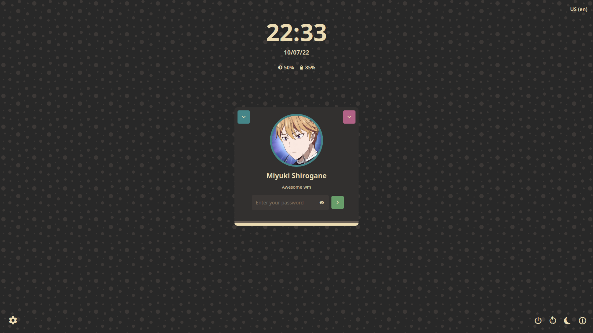
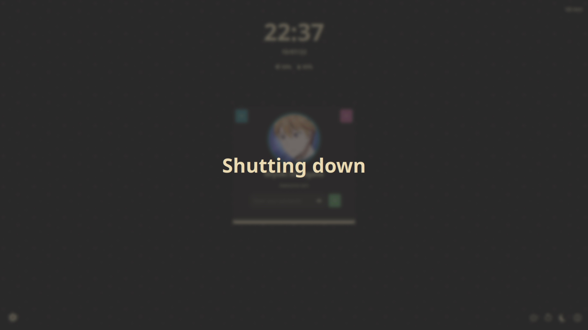
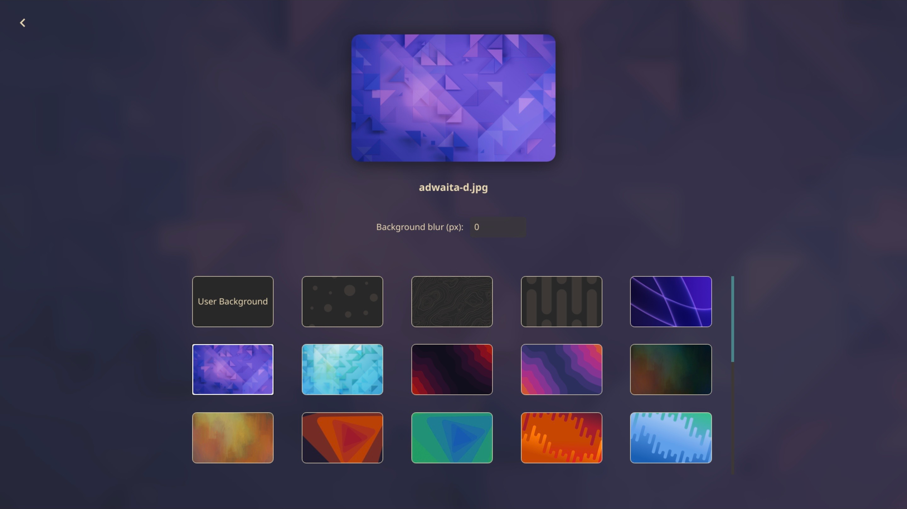

# Web Greeter gruvbox theme

## Overview

This is a web-greeter theme for Carbonix, forked from the original gruvbox theme included in web-greeter.

[//]: # (## Screenshots)

[//]: # (
)

[//]: # ()

[//]: # ()
[//]: # ()

[//]: # ()
[//]: # ()

[//]: # (
)

[//]: # (## Installation)

[//]: # (This theme is shipped with `web-greeter`. To use it, set the `theme` as `gruvbox` inside `/etc/lightdm/web-greeter.yml`)

## TODO

- Translations support

[web-greeter]: https://github.com/JezerM/web-greeter "Web Greeter"
[glorious]: https://github.com/manilarome/lightdm-webkit2-theme-glorious "Glorious"
